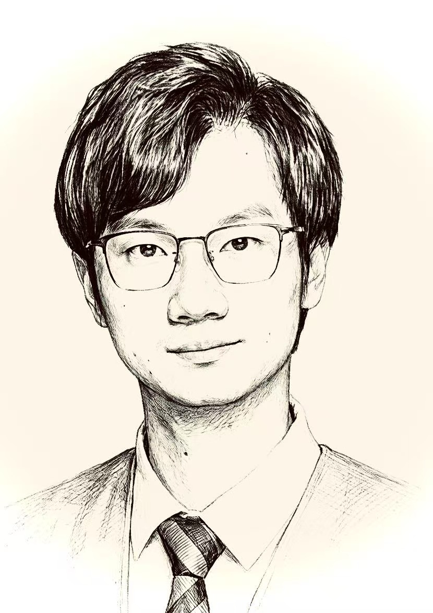

```{=html}
<div class="music-meta" data-src="music/home.mp3" data-title="Homecoming" data-artist="Evan Call" style="display:none;"></div>
```

::: {.home-page}

::: {.home-title-section}
```{=html}
<h1 class="xanadu-animated-title">
  <span class="word"><span class="drop-cap" style="animation-delay: 0s;">W</span>illiam</span>
  <span class="word"><span class="drop-cap" style="animation-delay: 0s;">K</span>ing's</span>
  <span class="word"><span class="drop-cap" style="animation-delay: 0s;">H</span>omepage</span>
</h1>
```
:::

::: {.home-container}

::: {.home-left}
```{=html}

```
:::

::: {.home-right}

```{=html}
<h1 class="typewriter-title">
  <span class="typewriter-text"></span><span class="typewriter-cursor">|</span>
</h1>
<script>
document.addEventListener('DOMContentLoaded', function() {
  const text = "Hi, I'm 王朱逸男";
  const el = document.querySelector('.typewriter-text');
  const cursor = document.querySelector('.typewriter-cursor');
  let i = 0;
  const speed = 110;

  function type() {
    if (i < text.length) {
      el.textContent += text.charAt(i);
      i++;
      setTimeout(type, speed);
    } else {
      cursor.style.animation = 'blink 1s step-end infinite';
    }
  }

  setTimeout(type, 500);
});
</script>
```

我是一名非典型的数学博士，杭州人，双鱼座，理性严谨与感性浪漫在我的体内不曾交战，反倒合伙开了一家美食工坊。

我本科到博士阶段都在浙江大学数学系，醉心于运筹学与排序博弈，期待用模型、算法和策略去拆解世界运行的底层逻辑，用数字去破解复杂世界，像一把手术刀剖开混沌，那是一种相当令我着迷的暴力美学。如今在中国科学院杭州医学研究所做博士后，把这种暴力美学搬进了AI驱动的智能制药的领域，研究纳米抗体与定向进化。说到底，都是在用数字规律探求复杂系统背后的最优解，不过对象从工件换成了蛋白质序列。

作为非典型数学博士，我的世界里远不只有公式和证明。理性的尽头，往往是更深的温柔与浪漫，诗与美食构建我的世界另一半不一样的色彩。有人问我，这样矛盾事情能不能既要又要。我的回答是：可以，只是需要更聪明更平衡的解法。

我极度热爱美食。常为了一个传闻中的小馆跨城驱车，不是为了打卡，而是为了遇见那种"就是她了"的味道。吃到的美味，总要尝试在自家厨房复刻，只怕将来不能再遇见，要将喜爱的味道留在身边。美食第一——或许已是我的人生奥义，点开"美食地图"，你将会发现一条我用真心绘制，由餐厅坐标连成的、曲折而真诚的轨迹。

生于杭州，长于杭州，三十余年未曾离开，以后也大概率不会远走他乡。我喜欢这座城市的湿润和克制，喜欢这座城市的诗意与浪漫，更喜欢它在整洁背后平衡的恰如其分的烟火气。总想把这里的每一条小巷、每一碗面条、每一个能看见西湖的转角，讲给懂的人听。

::: {.small-photo}
```{=html}

```
:::

:::

:::

::: {.experience-section}

## 经历

```{=html}
<div class="timeline">
  <div class="timeline-item left">
    <div class="timeline-content">
      <div class="timeline-date">2026.1 — 至今</div>
      <div class="timeline-text">中国科学院杭州医学研究所 · 博士后</div>
    </div>
  </div>
  <div class="timeline-item right">
    <div class="timeline-content">
      <div class="timeline-date">2015.09 — 2013.06</div>
      <div class="timeline-text">浙江大学 · 博士 — 运筹学与控制论</div>
    </div>
  </div>
  <div class="timeline-item left">
    <div class="timeline-content">
      <div class="timeline-date">2011.09 — 2015.06</div>
      <div class="timeline-text">浙江大学 · 本科 — 数学与应用数学</div>
    </div>
  </div>
  <div class="timeline-item right">
    <div class="timeline-content">
      <div class="timeline-date">2008.09 — 2011.06</div>
      <div class="timeline-text">杭州市学军中学 · 高中</div>
    </div>
  </div>
  <div class="timeline-item left">
    <div class="timeline-content">
      <div class="timeline-date">2005.09 — 2008.06</div>
      <div class="timeline-text">杭州市采荷实验中学 · 初中</div>
    </div>
  </div>
  <div class="timeline-item right">
    <div class="timeline-content">
      <div class="timeline-date">1999.09 — 2005.06</div>
      <div class="timeline-text">杭州市采荷第二小学 · 小学</div>
    </div>
  </div>
</div>
```

:::

::: {.links-section}

## 探索更多

```{=html}
<div class="links-grid">
  <div class="link-card">
    <div class="link-title">学术发表</div>
    <div class="link-desc">这里没什么有趣的东西，不过是论文与专利</div>
    <a href="publications.qmd" class="link-btn">进入 →</a>
  </div>
  <div class="link-card">
    <div class="link-title">美食地图</div>
    <div class="link-desc">一张由餐厅坐标连成的真诚轨迹。</div>
    <a href="foodmap.qmd" class="link-btn">进入 →</a>
  </div>
  <div class="link-card">
    <div class="link-title">笔下桃源</div>
    <div class="link-desc">数学博士的别样浪漫</div>
    <a href="xanadu.qmd" class="link-btn">进入 →</a>
  </div>
</div>
```

:::

::: {.home-bottom-bar}
:::

:::
